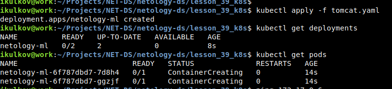

## Домашняя работа к занятию “Docker и микросервисная архитектура”

### Ответы на вопросы

#### ● Что такое k8s?

k8s - набор сервис для управления контейниризированными приложениями и необходимыми ресурсами для их работы, мониторинг работы приложений в контейнерах.

#### ● В чём преимущество контейнеризации над виртуализацией?

Виртуализация требует наличия гипервизора для запуска виртуальных машин с гостевыми операционными системами, в которых уже запускаются необходимые сервисы и ПО для приложений. Контейниризация представляет более лёгкую среду для выполнения приложений за счёт предоставления ресурсов основной операционной системы, при этом создавая изолированные "песочницы" для отдельных приложений.

#### ● В чём состоит принцип самоконтроля k8s?

Мониторинг состояния работающих контейнеров. k8s может самостоятельно перезапускать нерабочие или сбоящие контейнеры и отключать их в соответствии с настроенными критериями работоспособностию

#### ● Как вы думаете, зачем Вам понимать принципы деплоя в k8s?

Для более успешного общения с системными администраторами, обеспечивающими работу кластера k8s, и управляющими процессами CI/CD на производстве.

#### ● Какое из средств управления секретами наиболее распространено в использовании совместно с k8s?

k8s предлагает собственные средства для работы с секретами.

И, насколько понял из лекции, пользуется популярностью [HashiCorp Vault](https://www.vaultproject.io/docs/platform/k8s)

#### ● Какие типы нод есть в k8s, каковы их базовые функции?

Как и в любой кластерной системе, в k8s есть 2 типа нод:

- Мастер-ноды или управляющие ноды
- Рабочие ноды или воркеры

Мастер-ноды выполняют различные управляющие процессы - хранение всей информации о кластере и подах, управление ресурсами, планировщик заданий жизненного цикла подов, мониторинг и логгирование и пр. административные задачи.

На воркерах же непосредственно выполняются контейнеризированные приложения и могут храниться данные приложений.

### Приложение k8s

[Манифест](tomcat.yaml)

Лог развёртывания на кластере Minikube:

