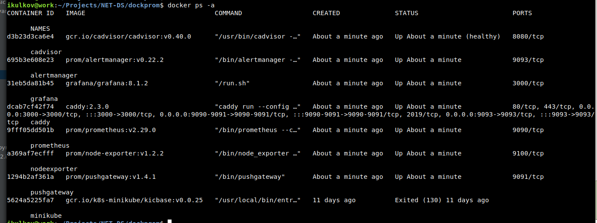
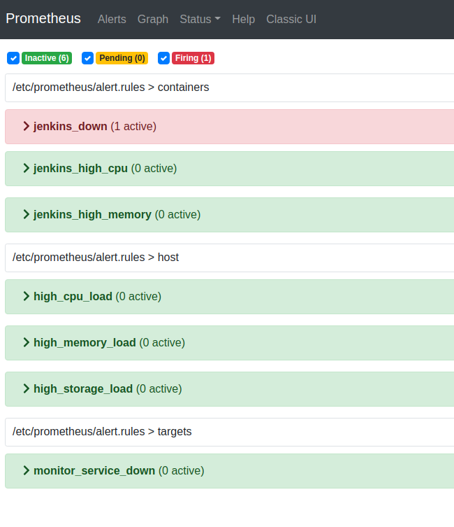
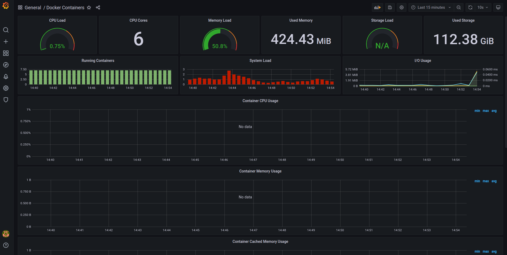

## Домашняя работа к занятию “Мониторинг”

Состояние запуска ознакомительной сборки [DockProm](https://github.com/stefanprodan/dockprom):

Настроенные алёрты в Prometheus:

- 3 алёрта для мониторинга контейнеров докера с Jenkins (запущен ли контейнер, высокая нагрузка на ЦПУ/Память)
- 3 алёрта для мониторинга хоста (высокая нагрузка на ЦПУ/Память/Хранилище)
- 1 алёрт для мониторинга собственного состояния

Настроенные дашборды в Grafana:

- Мониторинг докер-контейнеров, запущенных в системе
- Мониторинг хоста, на котором запущен докер-контейнер с Grafana
- Метрики и алёрты из Prometheus
- Мониторинг Nginx

Дашборд Docker Container в Grafana

