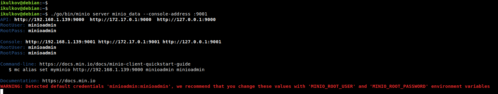
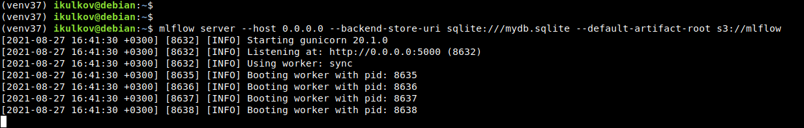
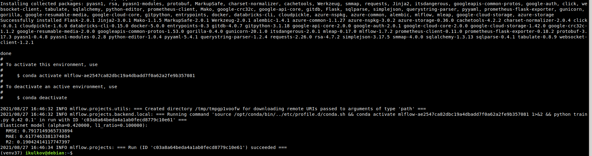
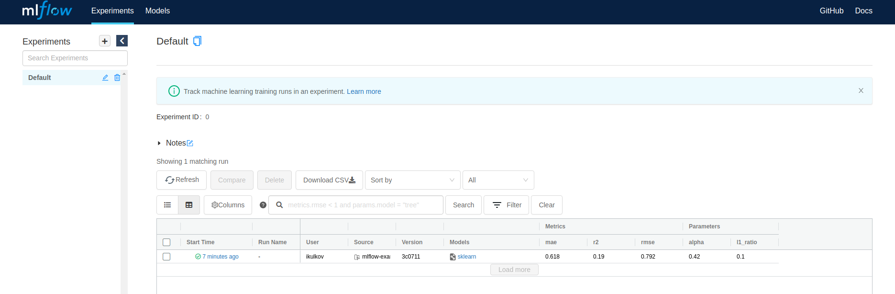
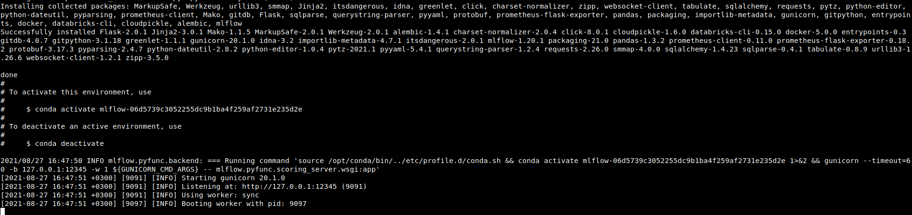
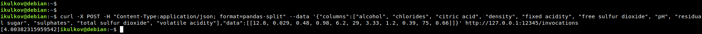

## Домашняя работа к занятию “MLOps/DataOps”

1. Устанавливаем и настраиваем conda

Конда установлена через apt-репозитарий

2. Устанавливаем и настраиваем python3

Python 3.7.3 уже установлен в Debian 10 по-умолчанию
Сделал отдельное виртуальное окружение, чтобы не ставить всё в системный питон:

```shell
python3.7 -m venv venv37
source venv37/bin/activate
pip install -U pip setuptools
```

3. Устанавливаем и настраиваем mlflow

```shell
pip install mlflow[extras]
```

4. Устанавливаем и настраиваем Настраиваем MinIO

Сначал пришлось устанавливать язык Go а потом собирать MinIO из исходных кодов, т.к. бинарники на офсайте не запускаются.

Сам сервер запускется следующей командой:

```shell
./go/bin/minio server minio_data --console-address :9001
```



5. Настраиваем окружение

Экспортируем пути для MinIO и mlflow:

```shell
export MLFLOW_TRACKING_URI=http://localhost:5000
export MLFLOW_S3_ENDPOINT_URL=http://localhost:9000
```

Авторизационные данные в MinIO:

```shell
cat > ~/.aws/credentials <<EOF
[default]
aws_access_key_id=minioadmin
aws_secret_access_key=minioadmin
EOF
```

6. Клонируем репозитарий https://github.com/mlflow/mlflow-example.git
И исправляем зависимости модели, т.к. в текущем виде оно неработоспособное совсем. Убрал явные зависимости на версии и добавил ещё boto3, чтоб mlflow мог подключаться к MinIO:
   
```yaml
name: tutorial
channels:
  - defaults
dependencies:
  - boto3
  - numpy
  - pandas
  - scikit-learn-intelex
  - pip
  - pip:
    - mlflow[extras]
```

7. Запускаем сервер mlflow:

```yaml
mlflow server --host 0.0.0.0 --backend-store-uri sqlite:///mydb.sqlite --default-artifact-root s3://mlflow
```



Для тестовых целей вполне хватит и SQLite, не надо возиться с настройкой MySQL/PostgreSQL

8. Готовим модель:

```shell
mlflow run Projects/mlflow-example -P alpha=0.42
```



Результат запуска в интерфейсе:



9. Запускаем:

```shell
mlflow models serve -m S3://mlflow/0/c03a8a64beda4a1ab0fecd8779c10e61/artifacts/model -p 12345
```



10. Проверяем работу:

```shell
curl -X POST -H "Content-Type:application/json; format=pandas-split" --data '{"columns":["alcohol", "chlorides", "citric acid", "density", "fixed acidity", "free sulfur dioxide", "pH", "residual sugar", "sulphates", "total sulfur dioxide", "volatile acidity"],"data":[[12.8, 0.029, 0.48, 0.98, 6.2, 29, 3.33, 1.2, 0.39, 75, 0.66]]}' http://127.0.0.1:12345/invocations
```


