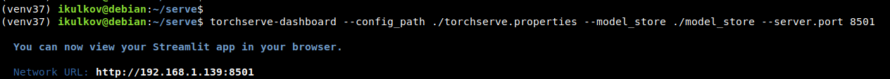
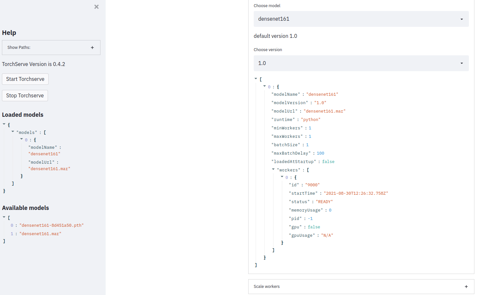

## Домашняя работа к занятию “Deply ML”

После настройки и установки TorchServe и его компонентов получаем:

Запущенная консоль torchserve-dashboard

Запущенная модель densenet161 в интерфейсе torchserve-dashboard:

